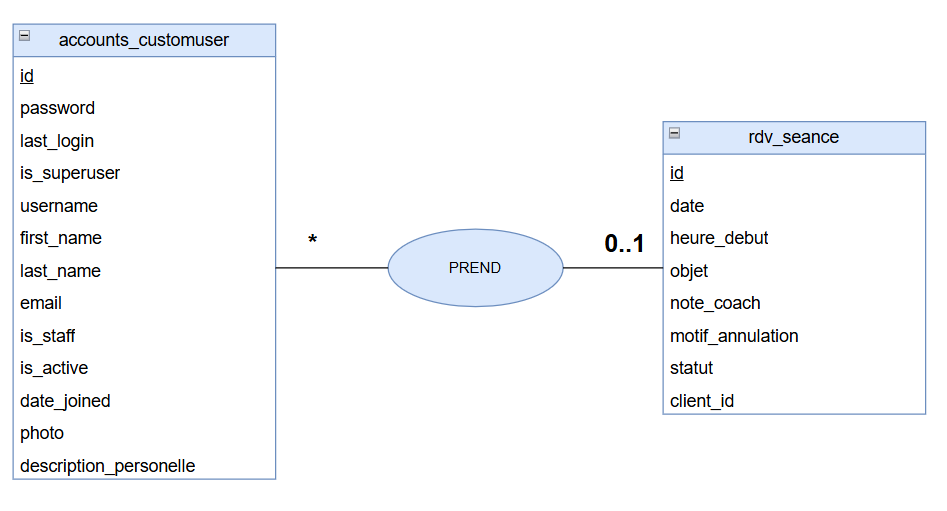
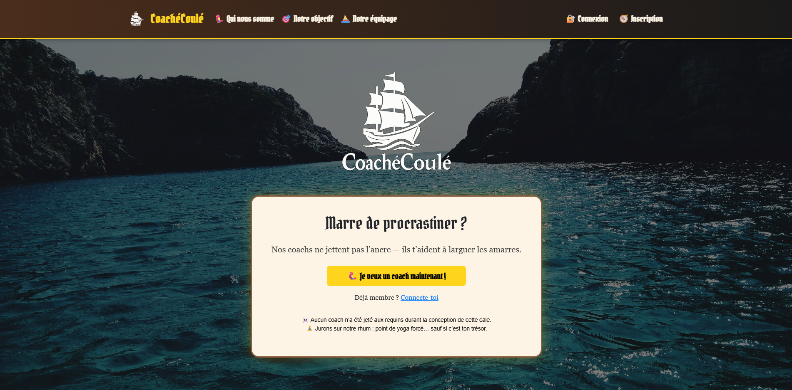

# Django Prise de Rendez-vous Coach/Client


[](https://choosealicense.com/licenses/mit/)


## 📘 Présentation du projet

Ce projet est une application Django permettant la gestion de rendez-vous entre des coachs et leurs clients. Les utilisateurs peuvent s’inscrire, se connecter, prendre des rendez-vous, consulter leur tableau de bord, et annuler des séances. Les coachs disposent d’un espace dédié pour suivre leurs rendez-vous et ajouter des notes.

### 🏴‍☠️ Pourquoi une identité visuelle pirate ?

L’univers graphique du site s’inspire de l’imaginaire pirate et maritime afin de proposer une expérience utilisateur originale et engageante. Ce choix de direction artistique (DA) répond à plusieurs objectifs :

- **Se démarquer** des plateformes classiques de coaching, souvent trop neutres ou impersonnelles.

- Évoquer le **voyage personnel** que représente le développement de soi : comme un navire quittant le port pour une aventure intérieure.

- Créer un **langage commun entre coachs et clients**, en les plaçant dans un même équipage, embarqués dans la quête d’un objectif commun.

- Utiliser des métaphores positives : cap à tenir (objectif), boussole (guidance), carte au trésor (plan d’action), etc.

Ce thème pirate rend la navigation plus ludique tout en renforçant le message : **"capitaine de ton propre parcours"**.


## 🏗️ Structure du projet

```bash
.
├── manage.py                    # Outil en ligne de commande pour gérer le projet Django
├── requirements.txt             # Liste des dépendances Python du projet
├── README.md                    # Documentation principale du projet
├── LICENCE                      # Licence du projet (MIT)
├── db.sqlite3                   # Base de données SQLite (par défaut en dev)
│
├── coach_app/                   # Dossier de configuration principale du projet Django
│   ├── __init__.py
│   ├── settings.py              # Paramètres du projet (apps, base de données, etc.)
│   ├── urls.py                  # Routes principales (inclut les routes des apps)
│   └── wsgi.py                  # Interface WSGI pour le déploiement
│
├── rdv/                         # Application principale de gestion des rendez-vous
│   ├── migrations/              # Fichiers de migration pour les modèles
│   ├── tests/                   # Tests unitaires de l'application (modèles, vues, formulaires)
│   ├── services/                # Fonction utilisé dans les views
│   ├── admin.py                 # Configuration de l'interface d'administration
│   ├── apps.py                  # Configuration de l’application `rdv`
│   ├── forms.py                 # Formulaires personnalisés (prise de RDV, annulation)
│   ├── models.py                # Modèle `Seance` (rendez-vous)
│   ├── urls.py                  # Routes de l’application `rdv`
│   └── views.py                 # Logique métier (dashboard, prise RDV, etc.)
│
├── accounts/                    # Application pour la gestion des comptes utilisateurs
│   ├── migrations/
│   ├── tests/
│   ├── services/                
│   ├── admin.py
│   ├── apps.py
│   ├── forms.py
│   ├── models.py
│   ├── urls.py
│   └── views.py
│
├── siteweb/                     # Application pour le contenu général du site (accueil, contact…)
│   ├── tests/
│   ├── services/                
│   ├── admin.py
│   ├── apps.py
│   ├── forms.py
│   ├── models.py
│   ├── urls.py
│   └── views.py
│
├── core/                        # Composants partagés et utilitaires
│   ├── decorators.py            # Décorateurs personnalisés (ex : vérification de rôle)
│   └── context_processors.py    # Variables globales injectées dans tous les templates
│
├── templates/                   # Fichiers HTML organisés par application
│   ├── accounts/
│   ├── admin/
│   ├── rdv/
│   ├── siteweb/
│   ├── base.html                # Template de base commun à tout le site
│   ├── footer.html              # Pied de page partagé
│   └── navbar.html              # Barre de navigation partagée
│
├── static/                      # Fichiers statiques globaux (CSS, JS, images)
├── media/                       # Fichiers uploadés (ex : photos de profil)
```

## 📂 Organisation des apps Django

Le projet est divisé en trois applications Django distinctes, chacune ayant une responsabilité bien définie pour assurer une architecture claire, maintenable et évolutive :

1. `accounts` – 🔐 Gestion des utilisateurs
Responsable de toute la logique liée aux comptes (utilisateurs personnalisés, groupes, connexion, inscription...).

Fonctionnalités :
- Formulaire d’inscription avec email d’activation
- Login / logout personnalisés
- Vue "Mon compte" affichant le rôle (client ou coach)
- Utilisateur personnalisé (CustomUser) avec photo et bio
- Attribution automatique au groupe client
- Support des groupes coach et coach admin

2. `rdv` – 📅 Prise de rendez-vous
Contient toutes les fonctionnalités liées à la gestion des séances entre clients et coachs.

Fonctionnalités :
- Création de rendez-vous (clients uniquement)
- Tableau de bord client et coach (séances à venir / passées)
- Annulation de rendez-vous (par le coach avec motif)
- Notes internes du coach
- Vue détaillée d’une séance
- Formulaires personnalisés avec validation (conflits d’horaire, créneau, etc.)

3. `siteweb` – 🌐 Pages informatives
Application simple contenant les pages publiques du site (sans logique métier).

Pages disponibles :
- Page d’accueil
- Page "À propos" 
- Page "Objectifs"
- Page "équipe" avec la liste des coachs

Ces vues utilisent des templates statiques ou semi-dynamiques, sans interaction avec des formulaires complexes.

## 🚀 Installation

1. Clone le dépôt :
```bash
git clone https://github.com/tonutilisateur/tonprojet.git
cd tonprojet
```

2. Crée un environnement virtuel et active-le :
```bash
python -m venv .venv
source .venv/bin/activate  # Linux / MacOS
.venv\Scripts\activate     # Windows
```

3. installer les dépendances :
```bash
pip install -r requirements.txt
```

4. Configure la base de données (SQLite par défaut, modifier settings.py pour autre chose)

5. creer les migrations :
```bash
python manage.py makemigrations
```

si les dossiers de migration ne sont pas creer, utiliser ces commande:
```bash
python manage.py makemigrations accounts
python manage.py makemigrations rdv
```

6. Appliquer les migrations :
```bash
python manage.py migrate
```

7. Crée un superutilisateur :
```bash
python manage.py createsuperuser
```

8. Lancer l'application :
```bash
python manage.py runserver
```

## 📧 Utilisation de Mailcatcher

Lorsque l'utilisateur crée un compte, il reçoit un email de confirmation contenant un lien d'activation. En environnement de développement, nous utilisons MailCatcher pour intercepter et visualiser ces emails sans envoyer de vrai mail.

### Installer MailCatcher

Lien de MailCatcher: [https://mailcatcher.me/](https://mailcatcher.me/)

### Configuration dans `settings.py`
pour utiliser MailCatcheur, il faut le configurer dans le settings.py
```python
EMAIL_HOST = 'localhost'
EMAIL_PORT = 1025
EMAIL_HOST_USER = ''
EMAIL_HOST_PASSWORD = ''
EMAIL_USE_TLS = False
EMAIL_USE_SSL = False
DEFAULT_FROM_EMAIL = 'pirate@bateau-noir.fr'
```

>(à modifier lors de la mise en prod)

### Utiliser MailCatcher

lancer la commande dans le CMD:
```bash
mailcatcher
```

visualisation des mails: [http://localhost:1080](http://localhost:1080)

## 🧪 Tests unitaire

Lancer tout les tests unitaire:
```bash
python manage.py test 
``` 

Lancer un dossier test précis:
```bash
python manage.py test rdv 
``` 

Lancer une fonction précis d'un test :
```bash
python manage.py test rdv.test.test_models 
```

Fichier de tests:
1. `rdv`
2. `accounts`
3. `siteweb`

## 🏦 Base de données

### 📅 MCD


### 🧾 MLD

accounts_customuser:
```sql
TABLE accounts_customuser (
    id                          INTEGER          PK AUTOINCREMENT,
    password                    VARCHAR(128)     NOT NULL,
    last_login                  DATETIME         NULL,
    is_superuser                BOOLEAN          NOT NULL DEFAULT FALSE,
    username                    VARCHAR(150)     NOT NULL UNIQUE,
    first_name                  VARCHAR(150)     NOT NULL,
    last_name                   VARCHAR(150)     NOT NULL,
    email                       VARCHAR(254)     NOT NULL,
    is_staff                    BOOLEAN          NOT NULL DEFAULT FALSE,
    is_active                   BOOLEAN          NOT NULL DEFAULT TRUE,
    date_joined                 DATETIME         NOT NULL,
    prenom                      VARCHAR(100)     NOT NULL,
    nom                         VARCHAR(100)     NOT NULL,
    photo                       VARCHAR(100)     NULL,         -- Chemin du fichier image
    description_personnelle     TEXT             NULL
)
```

rdv_seance:
```sql
TABLE rdv_seance (
    id                  INTEGER      PK AUTOINCREMENT,
    date                DATE         NOT NULL,
    heure_debut         TIME         NOT NULL,
    objet               VARCHAR(200) NOT NULL,
    note_coach          TEXT         NULL,
    client_id           BIGINT       NOT NULL,               -- FK → accounts_customuser(id)
    motif_annulation    TEXT         NULL,
    statut              VARCHAR(10)  NOT NULL DEFAULT 'actif',

    CONSTRAINT fk_client FOREIGN KEY (client_id) REFERENCES accounts_customuser(id),
    CONSTRAINT uniq_creneau UNIQUE (date, heure_debut)
)

```

## 🔐 Authentification & Rôles

Le projet utilise le système d’authentification intégré de Django, enrichi par une gestion des rôles via les groupes (auth_group). Chaque utilisateur appartient à l’un des groupes suivants :

- 👤 Client
    - S'inscrit via un formulaire (/signup/)
    - Reçoit un email d'activation (via Mailcatcher en dev)
    - Peut se connecter, consulter son tableau de bord et :
        - Prendre un rendez-vous
        - Annuler une séance avec un coach
        - Voir ses séances passées et à venir
- 🧑‍🏫 Coach
    - Assigné manuellement au groupe "coach" via l’administration Django
    - Peut accéder à un tableau de bord spécifique (coach)
    - Peut consulter tous les rendez-vous
    - Peut ajouter des notes internes sur les séances
    - Peut annuler un rendez-vous (en saisissant un motif)
- 🧑‍💼 Coach admin
    - Même comportement que le rôle coach
    - Peut avoir un accès étendu ou administratif (selon la configuration)
    - Utilisé pour distinguer les coachs ayant des responsabilités spécifiques

> Lors de l'inscription, les utilisateurs sont automatiquement ajoutés au groupe client.

> Les rôles coach et coach admin sont attribués via le panneau d'administration Django (/admin/), en affectant l'utilisateur aux groupes correspondants.


## 📚 Fonctionnalités
- Inscription avec confirmation par email (Mailcatcher en dev)
- Connexion/déconnexion
- Tableau de bord différencié client / coach
- Prise de rendez-vous avec vérification de conflits
- Annulation avec saisie de motif
- Notes internes du coach
- Administration Django

## 🖼️ Capture d'écran




## 📄 Licence
Ce projet est sous licence MIT — voir le fichier LICENSE.